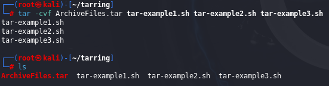

---
categories:
- Computer Science
- Linux System
date: 2024-03-21 13:00:00 +0530
description: Malware analysis is the study of the unique features, objectives, sources, and potential effects of harmful software and code, such as spyware, viruses, malvertising, and ransomware.
img_path: /assets/
published: true
tags:
- compress
- tar
- gzip2
- linux 
title: 'Compressing And Archiving In Linux System'
---

---

Sometimes you need to download and install new software, as well as send and download **multiple** large files. These tasks are easier if these files are compressed and combined into a single file.

Compressing comes into that story.

## What Is Compressing?

---

- **Compression**, as the name implies, makes data smaller, thereby requiring less storage capacity and making the data easier to transmit.

We can categorize compression as either ***lossy*** or ***lossless.***

### Lossy type

**Lossy Compression** is very effective in reducing the size of files, but the integrity of the information is lost.

This type of compression works great for graphics, video, and audio files, where a small difference in the file is hardly noticeable - *.mp3, .mp4* and *.jpg*

The strengths of lossy compression are its efficiency and effectiveness.

### Lossless type

**Lossless Compression** is available from a number of utilities and algorithms.

This type is not as efficient as lossy compression, but for hacking purposes, integrity is often far more important than compression ratio.

## Tarring Files Together

---

First thing you do when compressing files is to combine them into an archive.

In most cases, when archiving files, you’ll use the ***tar*** command.

The ***tar*** command creates a single files from many files, which is then referred to as an *archive, tar file, or tarball.* ****

Process of creating a single archive file:

- option -c means create
- option -v (stands for verbose and is optional) lists the file that tar is dealing with
- option -f means write to the following file

As we see in the image bellow ArchiveFiles.tar have size of 10240 bytes, and all three that is created for demonstrating in this example have 0 bytes of size.

In other words, tar uses significant overhead to perform this operation.

We can display files from the tarball, without extracting them, by using tar command with -t option:

We can extract files from the tarball using the tar command with the -x option:

## Compressing Files

---

Now we have one archived file, but that file is bigger than the sum of the original files.

For file transfer is better to compress those files, so we will look at these options: 

- **gzip**, which uses the extension ***.tar***.gz or ***.tgz***
- **bzip2**, which uses the extension ***.tar.bz2***
- **compress**, witch uses the extension ***.tar.z***

These all are capable of compressing our files, but they use different compression algorithms and have different compression ratios.

- compress is the fastest, but files are longer
- bzip2 is the slowest, but files are the smallest
- gzip falls somwhere between

### gzip

---

You can compress you file by entering the following:

Notice that file size has been compressed to just **164** bytes!

We can decompress that same file by using ***gunzip*** command

### bzip2

---

Another of the other widely used compression utilities in Linux is bzip2, which works similarly to gzip but has better compression ratios, meaning that the resulting file will be even smaller.

When you do a long listing, you can see that bzip2 has compressed the
file down to just 152 bytes!

We can decompress that same file by using ***bunzip2***

### compress

---

Finally, you can use the command compress to compress the file. This is probably the least commonly used compression utility, but it’s easy to remember. To use it, simply enter the command compress followed by the filename, like so:

Note that the compress utility reduced the size of the file to 321 bytes,
more than twice the size of bzip2.

To decompress the same file, use ***uncompress***

## Creating Bit-by-Bit or Physical Copies of Storage Devices

---

The ***dd*** command makes a bit-by-bit copy of a file, a filesystem, or even an entire hard drive.

Once a hacker has owned a target system, the ***dd*** command will allow them to copy the entire hard drive or a storage device to their system.

It’s critical to note that the ***dd*** command should not be used for typical day-to-day copying of files and storage devices because it is very slow; other commands do the job faster and more efficiently. It is, though, excellent when you need a copy of a storage device without the filesystem or other logical structures, such as in a forensic investigation