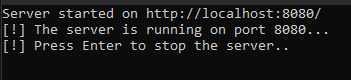

---
categories:
- Computer Science
- System Programming
date: 2024-06-27 13:00:00 +0530
description: This application is a scalable and efficient web service that uses an LRU cache, asynchronous programming, and threading to handle multiple concurrent client requests for searching songs via the Deezer API.
img_path: /assets/
published: true
tags:
- system programming
- C# 
title: 'High-Performance Deezer API Server with Caching'
---

## General

---

This application was implemented as part of the System Programming course at the university. Course content:

1. Executable file format. Code portability.
2. Debugging and profiling programs.
3. Memory grabs, memory leaks and automatic freeing memory.
4. Linking and loading program libraries.
5. Concurrent programming: processes and threads.
6. The problem of race (race conditions), synchronization yand reciprocity exclusion.
7. Primitives for synchronization and locking in modern ones programming languages. 
8. Blocking lock.
9. Non-blocking lock.
10. Event-based programming.
11. Asynchronous I/O operations and asynchronous execution of tasks.

## Description of the task to be implemented

Create a Web server that allows the client to search for songs using the Deezer API. The search for songs can be done using the Advanced search option explained in the documentation ([https://developers.deezer.com/api/search](https://developers.deezer.com/api/search)). The list of songs that meet the criteria are returned as a response to the client. All requests to the server are sent via the browser using the GET method. If the specified song does not exist, display an error to the client. Example server call: [https://api.deezer.com/search?q=artist:"coldplay"](https://api.deezer.com/search?q=artist:%22coldplay%22)

### Requirements:

- Tasks and asynchronous operations should be used (where it makes sense).
- Classic threads should be kept for processing where tasks do not make sense.
- The use of mechanisms for mutual locking and synchronization is allowed.

You can find the entire application code at the following link:

[https://github.com/vukasinsec/SysProg](https://github.com/vukasinsec/SysProg)

### Main

---

This C# program starts an HTTP server on the local machine (`localhost`) at port `8080`, with a cache capacity of `100` units. First, the URL and cache capacity are defined, then an instance of the `WebServer` class is created with these parameters. The server is started by calling the `Start()` method, and a message indicating the successful start is displayed on the console. The program pauses until the user presses Enter, achieved through the `Console.ReadLine()` method. Once the user presses Enter, the `Stop()` method is called to stop the server.

```csharp
static void Main(string[] args)
        {
            string url = "http://localhost:8080/";
            int cacheCapacity = 100;

            var server = new WebServer(url, cacheCapacity);
            server.Start();
            Console.WriteLine("[!] The server is running on port 8080...");
            Console.WriteLine("[!] Press Enter to stop the server..");
            Console.ReadLine();
            server.Stop();
        }
```

### Cache service

---

This implementation defines an LRU (Least Recently Used) cache using a generic class `LRUCache<TKey, TValue>`. It maintains a cache of a specified capacity with a `Dictionary<TKey, TValue>` for fast lookups and a `LinkedList<TKey>` to track the order of access. The `TryGetValue` method attempts to retrieve a value from the cache, updating the access order if successful. The `AddOrUpdate` method adds a new key-value pair or updates an existing one, ensuring the cache does not exceed its capacity by removing the least recently used item if necessary. Thread safety is managed using `lock` statements on `_accessOrder` during operations to prevent race conditions.

```csharp
public class LRUCache<TKey, TValue>
    {
        private readonly int _capacity;
        private readonly LinkedList<TKey> _accessOrder;
        private readonly Dictionary<TKey, TValue> _cache;
        public LRUCache(int capacity)
        {
            _capacity = capacity;
            _accessOrder = new LinkedList<TKey>();
            _cache = new Dictionary<TKey, TValue>();
        }
        public bool TryGetValue(TKey key, out TValue value)
        {
            lock (_accessOrder)
            {
                if (_cache.TryGetValue(key, out value))
                {
                    _accessOrder.Remove(key);
                    _accessOrder.AddLast(key);
                    return true;
                }
                return false;
            }
        }
        public void AddOrUpdate(TKey key, TValue value)
        {
            lock (_accessOrder)
            {
                if (_cache.ContainsKey(key))
                {
                    _accessOrder.Remove(key);
                }
                else if (_cache.Count >= _capacity)
                {
                    TKey leastUsed = _accessOrder.First.Value;
                    _cache.Remove(leastUsed);
                    _accessOrder.RemoveFirst();
                }
                _cache[key] = value;
                _accessOrder.AddLast(key);
            }
        }
    }
```

### Web Server class

---

The constructor initializes a `WebServer` object with a specified listening URL and cache capacity. It sets up an `HttpListener` object for listening to incoming requests, adds a prefix for the specified URL, initializes a `JSONParser`instance for parsing JSON data, creates an `LRUCache<string, string>` for caching API call results, and initializes `ReaderWriterLockSlim` instances for thread-safe locking of the cache and file operations.

```csharp
private readonly HttpListener _listener;
        private readonly JSONParser _jsonParser;
        private readonly LRUCache<string, string> _cache;
        private readonly ReaderWriterLockSlim _cacheLock;
        private readonly ReaderWriterLockSlim _fileLock;

        public string Url { get; }

        public WebServer(string url, int cacheCapacity)
        {
            _listener = new HttpListener();
            Url = url;
            _listener.Prefixes.Add(Url);
            _jsonParser = new JSONParser();
            _cache = new LRUCache<string, string>(cacheCapacity);
            _cacheLock = new ReaderWriterLockSlim();
            _fileLock = new ReaderWriterLockSlim();
        }
```

The `Start()` method begins listening for incoming requests by calling `HttpListener.Start()` and prints a message to the console indicating the server has started. It asynchronously starts the `ListenAsync()` method to allow continuous listening for incoming requests without blocking the main thread.

```csharp
public void Start()
        {
            _listener.Start();
            Console.WriteLine($"Server started on {Url}");
            _ = ListenAsync(); 
        }
```

The `Stop()` method stops the `HttpListener` and closes it. It prints a message to the console indicating the server has been stopped.

```csharp
public void Stop()
        {
            _listener.Stop();
            _listener.Close();
            Console.WriteLine("Server stoppped.");
        }
```

The private asynchronous method `ListenAsync()` indefinitely listens for incoming HTTP requests while the `HttpListener` is in a listening state. For each new request received, it asynchronously processes it using the `ProcessRequestAsync()` method.

```csharp
private async Task ListenAsync()
        {
            try
            {
                while (_listener.IsListening)
                {
                    var context = await _listener.GetContextAsync();
                    _ = ProcessRequestAsync(context); 
                }
            }
            catch (Exception ex)
            {
                Console.WriteLine($"Listening error: {ex.Message}");
            }
        }
```

This method asynchronously handles each HTTP request. It first retrieves data from the request, constructs the Deezer API URL, checks if the data is already cached. If cached, it retrieves it from the cache; otherwise, it fetches data from the API, adds it to the cache, and prints an appropriate message. Then, it parses the JSON response, extracts song titles using `_jsonParser`, writes the titles to a file using `WriteDataToFileAsync()` method. Finally, it sets the appropriate status and content type for the HTTP response based on the request processing outcome.

```csharp
private async Task ProcessRequestAsync(HttpListenerContext context)
        {
            HttpListenerRequest request = context.Request;
            HttpListenerResponse response = context.Response;

            try
            {
                string query = Uri.EscapeDataString(request.QueryString["q"]);
                string apiUrl = $"https://api.deezer.com/search?q={query}";

                string responseData;
                _cacheLock.EnterReadLock();
                try
                {
                    if (_cache.TryGetValue(apiUrl, out responseData))
                    {
                        Console.WriteLine("[!] Data fetched from cache!");
                    }
                    else
                    {
                        _cacheLock.ExitReadLock(); 
                        responseData = await GetDataFromApiAsync(apiUrl);
                        _cacheLock.EnterWriteLock();
                        try
                        {
                            _cache.AddOrUpdate(apiUrl, responseData);
                        }
                        finally
                        {
                            _cacheLock.ExitWriteLock();
                        }
                        Console.WriteLine("[!] The data was obtained from the API!");
                    }
                }
                finally
                {
                    if (_cacheLock.IsReadLockHeld)
                        _cacheLock.ExitReadLock();
                }

                JObject jsonData = JObject.Parse(responseData);
                List<string> titles = _jsonParser.ExtractTitles(jsonData);

                await WriteDataToFileAsync(titles);

                response.StatusCode = (int)HttpStatusCode.OK;
                response.ContentType = "application/json";

                using (StreamWriter writer = new StreamWriter(response.OutputStream))
                {
                    foreach (var title in titles)
                    {
                        await writer.WriteLineAsync(title);
                    }
                }
            }
            catch (TimeoutException ex)
            {
                response.StatusCode = (int)HttpStatusCode.RequestTimeout;
                using (StreamWriter writer = new StreamWriter(response.OutputStream))
                {
                    await writer.WriteAsync($"Timeout exception occurred: {ex.Message}");
                }
            }
            catch (HttpRequestException ex)
            {
                response.StatusCode = (int)HttpStatusCode.InternalServerError;
                using (StreamWriter writer = new StreamWriter(response.OutputStream))
                {
                    await writer.WriteAsync($"HTTP request exception occurred: {ex.Message}");
                }
            }
            catch (ArgumentException ex)
            {
                response.StatusCode = (int)HttpStatusCode.BadRequest;
                using (StreamWriter writer = new StreamWriter(response.OutputStream))
                {
                    await writer.WriteAsync($"Invalid request: {ex.Message}");
                }
            }
            catch (Exception ex)
            {
                response.StatusCode = (int)HttpStatusCode.InternalServerError;
                using (StreamWriter writer = new StreamWriter(response.OutputStream))
                {
                    await writer.WriteAsync($"An error occurred: {ex.Message}");
                }
            }
            finally
            {
                response.Close();
            }
        }
```

A private asynchronous method that uses `HttpClient` to send a GET request to the Deezer API at the specified URL. If the request is successful, it returns the response as a string; otherwise, it throws an exception with an appropriate error message.

```csharp
private async Task<string> GetDataFromApiAsync(string apiUrl)
        {
            using (HttpClient client = new HttpClient())
            {
                HttpResponseMessage response = await client.GetAsync(apiUrl);
                if (response.IsSuccessStatusCode)
                {
                    return await response.Content.ReadAsStringAsync();
                }
                else
                {
                    throw new Exception("Choosen song doesen't exists.");
                }
            }
        }
```

A private asynchronous method that locks `ReaderWriterLockSlim` for writing and appends song titles to a text file at the specified path. After completing the write operation, it releases the lock. If an error occurs during writing, it prints an error message to the console.

```csharp
private async Task WriteDataToFileAsync(List<string> titles)
        {
            _fileLock.EnterWriteLock();
            try
            {
                string filePath = @"C:\Users\Windows10\Desktop\GitHub\SysProg\izlaz.txt";
                using (StreamWriter writer = new StreamWriter(filePath, true))
                {
                    await writer.WriteLineAsync($"Retrieved at: {DateTime.Now}");
                    foreach (var title in titles)
                    {
                        await writer.WriteLineAsync(title);
                    }
                    await writer.WriteLineAsync("=======================================");
                }
            }
            catch (Exception ex)
            {
                Console.WriteLine($"An error occurred while writing to the file: {ex.Message}");
            }
            finally
            {
                _fileLock.ExitWriteLock();
            }
        }
```

### Json parser helper class

The `JSONParser` class provides functionality to extract song titles from JSON data obtained from an API response. Here's a brief description of its method:

```csharp
public class JSONParser
    {
        public List<string> ExtractTitles(JObject jsonData)
        {
            List<string> titles = new List<string>();

            try
            {
                var dataArray = (JArray)jsonData["data"];

                foreach (var item in dataArray)
                {
                    string title = (string)item["title"];
                    titles.Add(title);
                }
            }
            catch (Exception ex)
            {
                Console.WriteLine("Error while extracting titles: " + ex.Message);
            }
            return titles;
        }
    }
```

## Python script

---

This Python script simulates multiple clients sending HTTP GET requests to a local server to search for songs either by artist name or album name. The `send_request` function constructs the appropriate URL based on the user's option and query, sends a GET request using the `requests` library, and prints the response. The `create_clients` function creates and starts multiple threads to simulate concurrent clients, each sending requests with the specified options and queries. The main block of the script prompts the user to select a search option and input a corresponding query. It then simulates 50 clients making the initial requests, waits for 2 seconds, and simulates another 50 clients making repeated requests, expecting the responses to come from the cache. This script demonstrates how to test the performance and caching functionality of the local server under concurrent load.

```python
import requests
import threading
import time

def send_request(option, query):
    if option == 1:
        url = f"http://localhost:8080/?q=artist:\"{query}\""
    elif option == 2:
        url = f"http://localhost:8080/?q=album:\"{query}\""
    else:
        print("You have entered an invalid option.")
        return

    response = requests.get(url)
    print(f"Search result for '{query}': {response.text}")

def create_clients(options, queries, num_clients):
    threads = []
    for _ in range(num_clients):
        for option, query in zip(options, queries):
            thread = threading.Thread(target=send_request, args=(option, query))
            threads.append(thread)
            thread.start()

    for thread in threads:
        thread.join()

if __name__ == "__main__":
    print("Welcome! Please choose one of the following options:")
    print("1. Search for songs by artist name")
    print("2. Search for songs by album name")

    option = int(input("Enter the option number: "))
    if option not in [1, 2]:
        print("Invalid input. Please enter an option number.")
        exit()

    queries = []
    if option == 1:
        artist_name = input("Enter the artist name for the search: ")
        if not artist_name:
            print("You did not enter anything.")
            exit()
        queries.append(artist_name)
    elif option == 2:
        album_name = input("Enter the album name for the search: ")
        if not album_name:
            print("You did not enter anything.")
            exit()
        queries.append(album_name)

    num_clients = 50
    print(f"First requests, expecting data from the API for {num_clients} clients:")
    create_clients([option] * len(queries), queries, num_clients)
    time.sleep(2)

    print(f"\nSending requests again, expecting cached data for {num_clients} clients:")
    create_clients([option] * len(queries), queries, num_clients)
```

## Testing

---

After starting the application, a server listening on port 8080 is started.



After selecting the option to perform a search by artist and entering the artist itself, we get the results.


Checking that the data is obtained from the api and later from the cache.


## Conclusion

---

The combination of a robust server implementation, effective caching, and client simulation provides a practical demonstration of how to build and test a scalable and efficient web service. This application highlights important concepts in web development, such as asynchronous programming, concurrency, caching, and error handling, making it a valuable learning tool for building reliable and performant web services.