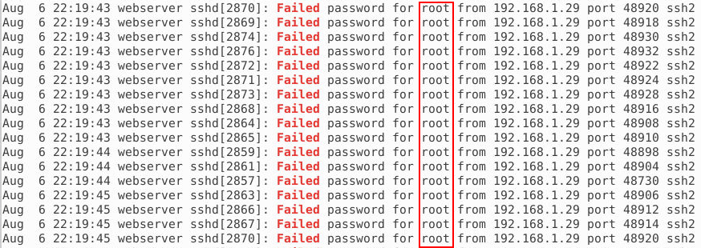
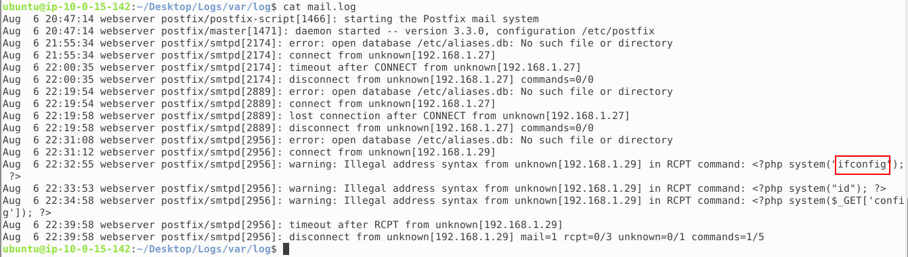
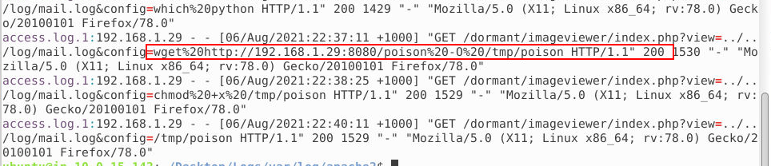

---
categories:
- Cyber security
- BTLO
date: 2024-09-17 13:00:00 +0530
description: This is medium incident response machine from Blue teams online.
img_path: /assets/
published: true
tags:
- incident response
- btlo
title: 'Venom BTLO - Incident Response'
---


## Scenario

We got you the **/var/log** folder of one of the compromised ubuntu server. Investigate the logs and figure out the point of entry of the attacker. You have raw logs (/var/log in Desktop), use your linux cli skills over the logs and answer the following.

## **Investigation Submission**

### What CMS is running on the web server? *(5 points)*

When we list the folder using the ls command, we see various files and folders. Since we are specifically interested in CMS, it is most logical to start from the apache2 folder. We navigate to that folder and start looking for an answer there.


After that, we'll use the `grep` command to search for the most popular CMS and see if we get any results.

```bash
grep -iR wordpress
```

- `i` → This option enables case-insensitive search.
- `R` → This option makes the search recursive, meaning it will search through all files in the current folder and its subfolders.


From the output, we can see GET requests for a WordPress page. In the root directory, we also notice Joomla, as WordPress was installed within the Joomla framework.

**Answer: Joomla**

### What is the IP of the attacker? *(5 points)*

As we can see, we have over several thousand requests for various wordpress pages. Based on this, we suspect that it is a brute force attack that tries to find legitimate pages. In the request itself, in addition to parameters such as Date and User Agent, we can also see from which IP address the requests come from. That address is the address of the attackers.


**Answer: 192.168.1.29**

### What is the username that has been brute forced by the attacker? *(6 points)*

To answer this question we will return to the /var/log folder. We see an interesting file called auth.log.

*The `auth.log` file is a log file in Unix-like systems (such as Linux) that records authentication-related events. It keeps track of user logins, failed login attempts, and authentication processes, including actions related to services like SSH or sudo. This log is crucial for monitoring security, as it can help administrators detect unauthorized access attempts or suspicious login activities.*

We will search the file by running the following command:

```bash
cat auth.log | grep Failed
```

After that, we see many requests using always the same username and a different password. This is a feature of a brute force attack.

*A brute force attack is a method used to crack passwords or encryption by systematically trying every possible combination until the correct one is found. This type of attack relies on computing power and time to eventually break through security.*



**Answer: root**

### What is the common name of the vulnerability exploited by the attacker? *(6 points)*

I started looking for an answer to this question by relying on the OWASP Top 10 list to guide my search. Knowing the common vulnerabilities allowed me to search the logs more efficiently. I concentrated on searching for potential attacks such as SQL injection, XSS, and of course, Local File Inclusion.

Using the grep command, I searched all files in the /apache directory for distinctive patterns and keywords associated with LFI attacks. In particular, I looked for terms like **../**, **include**, and **require**, which often indicate attempts to include files outside the intended boundaries of the application.

During analysis, I noticed suspicious requests in the logs that included patterns characteristic of an LFI attack. For example, I observed several GET requests that attempted to access files outside of the application's root directory, using ../ sequences to navigate through the directory structure. These requests suggested that the attackers attempted to access sensitive system files by exploiting vulnerabilities in the application.


**Answer: Local File Inclusion**

### Attacker viewed the contents of several files. What is the first file? *(6 points)*

While analyzing the logs in the /apache directory, I applied search techniques to detect possible Local File Inclusion (LFI) attacks. By studying the GET requests and their responses, I identified key attack indicators. In the logs, I noticed different HTTP status codes in the request responses:

302 Redirection: This code indicates that the resource has been temporarily moved to another location. In our case, it signaled that some requests did not directly display the requested files, but were redirected to another page.

404 Not Found: This code indicates that the requested resource was not found on the server. In our case, the responses with this code indicated that some of the requests were trying to access non-existent files.

200 OK: This code indicates that the request was successfully processed and the resource was found and delivered. We first saw this code in response to a request for the **/etc/passwd** file. This is our answer to the question.


Answer: **/etc/passwd**

### What is the username of the account that the attacker got access to? *(6 points)*

In this case, root used sudo to change ownership of the /var/www/html/joomla directory. Specifically, the command set the user and directory group to www-data.

What Does This Information Tell Us?
The chown command is used to change the ownership of files and directories. In this case, the ownership change to www-data suggests that the www-data user is connected to the directory used for the Joomla CMS.

Although the command was executed by the root user, the ownership change to **www-data** indicates that this user had access to the files in the /var/www/html/joomla directory. This may mean that the attacker may have had access as www-data or that this user account was relevant in the context of the attack.


Answer: **www-data**

### What is the first command executed by the attacker? *(6 points)*

If we go back to the apache2 folder and look at the logs, we see requests to the mail.log file near the end. In addition, we see the size of the response that the GET request returns.


If we look in the mail.log we can see the commands that the attacker executed.



Answer: **ifconfig**

### What is the URL from which the attacker tried downloading a malicious file? *(10 points)*

Again from the apache2 logs we can see the wget command. It needs to be decoded using cyber chef. In the end we see that what was downloaded was forwarded to /tmp/poison.




Answer: **http://192.168.1.29:8080/poison**

## Conclusion

This was not such a difficult machine considering that it was only necessary to read the logs.

**See you in the next investigation!**