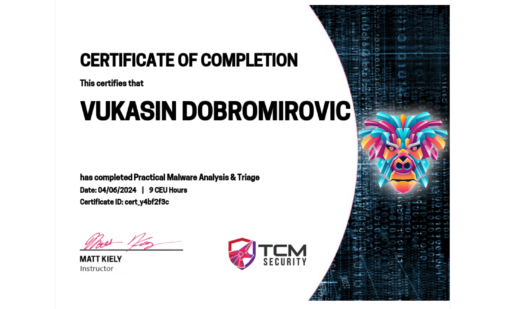
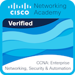
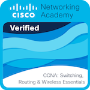
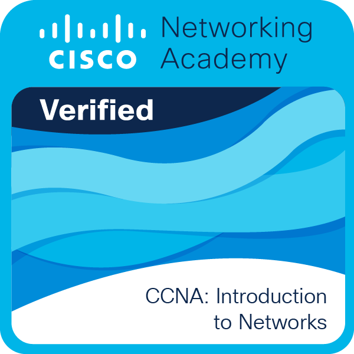

---
# the default layout is 'page'
icon: fas fa-info-circle
order: 5
---

- 📚 Currently working towards my Bachelor degree in Computer Science
- 🌐 I am interested in Cyber Security, Computer Science, Computer Networks
- ☣ Interested in the blue team and took the specialties Digital Forensics, Security Operating Center, Malware Analysis

## Certifications

#### Cybersecurity

- <a href="https://academy.tcm-sec.com/p/practical-malware-analysis-triage" target="_blank" rel="noopener noreferrer">Practical Malware Analysis & Triage</a> - Enables attendees to gain practical knowledge and skills in malware analysis and rapid prioritization of the analysis process.

#### Computer Networks

-  <a href="https://www.netacad.com/courses/networking/ccna-enterprise-networking-security-automation" target="_blank" rel="noopener noreferrer">CCNA: Enterprise Networking, Security, and Automation</a> - The course covers advanced routing techniques, connecting local area networks to the Internet, planning and
configuring WAN networks, as well as advanced network protocols and technologies.

- <a href="https://www.netacad.com/courses/networking ccna-switching-routing-wireless-essentials" target="_blank" rel="noopener noreferrer">CCNA: Switching, Wireless and Routing Essentials</a> - The course introduces students to the concepts of packet switching through the network and routing, as well as configuring routers, working with the Cisco operating system on network devices, configuring routing protocols, TCP/IP and access control (ACL), etc.

- <a href="https://www.netacad.com/courses/networking/ccna-introduction-networks" target="_blank" rel="noopener noreferrer">CCNA: Introduction to Networks</a> - It is an introduction to the field of computer networks, with emphasis on network terminology, protocols, LAN, MAN, OSI models, cabling, and tools for making and checking cables, Ethernet, IP addressing, and network
standards.

#### Programming

- <a href="https://pythoninstitute.org/pcap" target="_blank" rel="noopener noreferrer">PCAP - Programming Essentials in Python</a> - PCAP™ – Certified Associate Python Programmer certification focuses on the Object-Oriented Programming approach to Python, and shows that the individual is familiar with the more advanced aspects of programming, including the essentials of OOP, the essentials of modules and packages, the exception handling mechanism in OOP, advanced operations on strings, list comprehensions, lambdas, generators, closures, and file processing

- <a href="https://www.netacad.com/courses/networking/ccna-introduction-networks" target="_blank" rel="noopener noreferrer">NDG Linux Essentials</a>

---

## Badges

